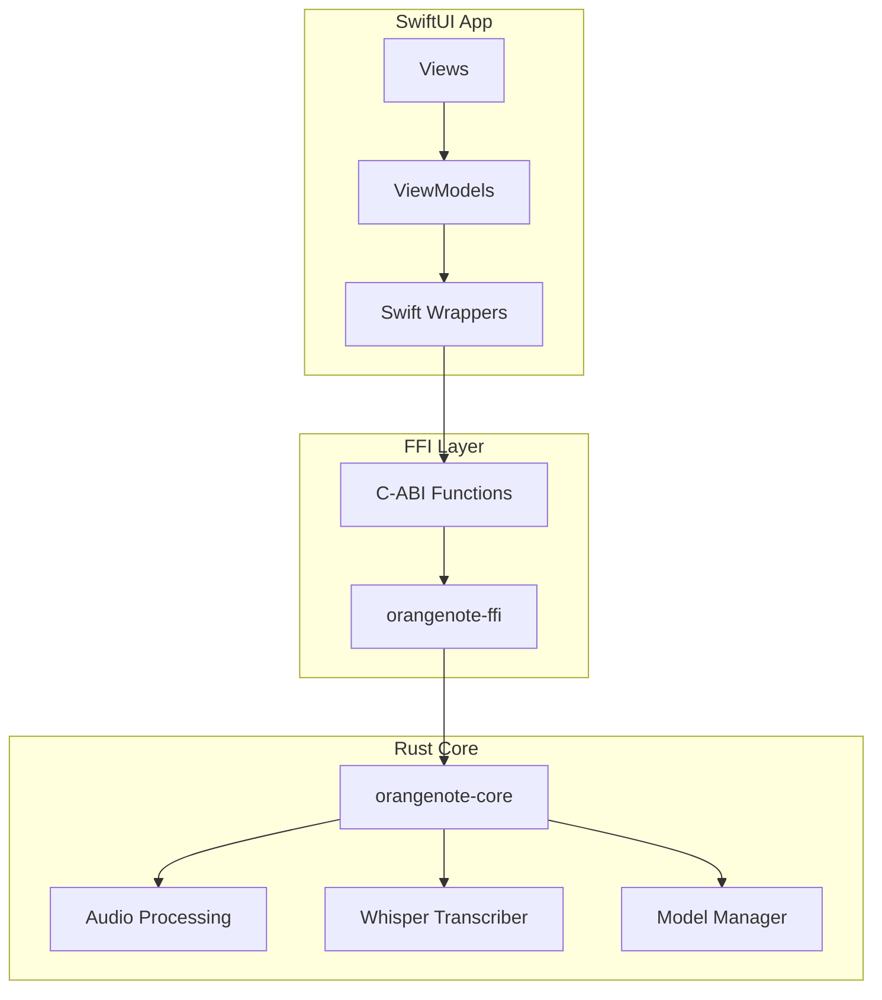
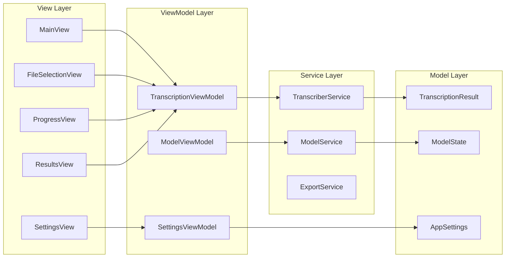
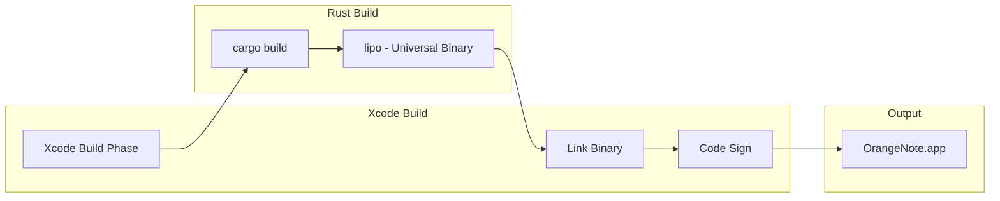

# OrangeNote macOS GUI Architecture

> SwiftUI application with Rust core for offline audio transcription

## Table of Contents

1. [Overview](#overview)
2. [Mono-Repo Workspace Structure](#mono-repo-workspace-structure)
3. [FFI Bridge Design](#ffi-bridge-design)
4. [Swift Side Architecture](#swift-side-architecture)
5. [MVP Screens](#mvp-screens)
6. [Build Pipeline](#build-pipeline)
7. [Directory Structure](#directory-structure)

---

## Overview

OrangeNote is a macOS application for offline audio transcription using whisper.cpp. The architecture follows Clean Architecture principles with clear separation between:

- **Core Layer** (Rust): Business logic, audio processing, transcription engine
- **FFI Layer** (Rust): C-ABI bridge exposing core functions to Swift
- **Presentation Layer** (Swift/SwiftUI): macOS GUI following MVVM pattern

### Architecture Diagram



---

## Mono-Repo Workspace Structure

The project uses a Cargo workspace with multiple crates:

```
orangenoteUI/
├── Cargo.toml              # Workspace root
├── orangenote-core/        # Existing Rust library (renamed from src/)
├── orangenote-ffi/         # C-ABI FFI layer
└── OrangeNote/             # Xcode project with SwiftUI app
```

### Workspace Cargo.toml

```toml
[workspace]
members = [
    "orangenote-core",
    "orangenote-ffi",
]
resolver = "2"

[workspace.package]
version = "0.2.0"
edition = "2021"
authors = ["OrangeNote Team"]

[workspace.dependencies]
anyhow = "1.0"
thiserror = "1.0"
log = "0.4"
```

### orangenote-core

The existing Rust library with transcription logic. Key public API:

| Type | Description |
|------|-------------|
| `WhisperTranscriber` | Main transcription engine |
| `WhisperModelManager` | Model download and caching |
| `ModelSize` | Enum: Tiny, Base, Small, Medium, Large |
| `TranscriptionResult` | Result with segments and language |
| `Segment` | Single transcribed segment with timestamps |
| `AudioProcessor` | Audio file to PCM conversion |
| `ChunkConfig` | Chunking configuration for long files |

### orangenote-ffi

New crate exposing C-ABI functions for Swift interop.

---

## FFI Bridge Design

### Approach: Manual C-ABI FFI

We use manual C-ABI FFI instead of UniFFI for several reasons:

1. **Simplicity**: Direct control over memory management
2. **Performance**: No overhead from generated bindings
3. **Transparency**: Clear understanding of what crosses the boundary
4. **Progress callbacks**: Native function pointer support

### Functions to Expose

#### Initialization and Cleanup

```rust
// orangenote-ffi/src/lib.rs

/// Initialize the transcriber with a model path
/// Returns: Handle to transcriber or null on error
#[no_mangle]
pub extern "C" fn orangenote_transcriber_new(
    model_path: *const c_char,
    threads: c_int,
    error_out: *mut *mut c_char,
) -> *mut OrangeNoteTranscriber;

/// Free the transcriber
#[no_mangle]
pub extern "C" fn orangenote_transcriber_free(
    transcriber: *mut OrangeNoteTranscriber,
);
```

#### Model Management

```rust
/// Get default model cache directory
/// Caller must free the returned string with orangenote_string_free
#[no_mangle]
pub extern "C" fn orangenote_model_cache_dir(
    error_out: *mut *mut c_char,
) -> *mut c_char;

/// Check if a model is cached
#[no_mangle]
pub extern "C" fn orangenote_model_is_cached(
    model_name: *const c_char,
) -> bool;

/// Get model file path (returns null if not cached)
#[no_mangle]
pub extern "C" fn orangenote_model_path(
    model_name: *const c_char,
    error_out: *mut *mut c_char,
) -> *mut c_char;

/// Download a model with progress callback
/// Progress callback: fn(downloaded_bytes: u64, total_bytes: u64, user_data: *mut c_void)
#[no_mangle]
pub extern "C" fn orangenote_model_download(
    model_name: *const c_char,
    progress_callback: Option<extern "C" fn(u64, u64, *mut c_void)>,
    user_data: *mut c_void,
    error_out: *mut *mut c_char,
) -> bool;
```

#### Transcription

```rust
/// Progress callback type for transcription
/// Parameters: current_chunk, total_chunks, user_data
pub type TranscriptionProgressCallback = 
    Option<extern "C" fn(c_int, c_int, *mut c_void)>;

/// Transcribe an audio file
/// Returns: JSON string with transcription result or null on error
#[no_mangle]
pub extern "C" fn orangenote_transcribe_file(
    transcriber: *mut OrangeNoteTranscriber,
    audio_path: *const c_char,
    language: *const c_char,  // null for auto-detect
    translate: bool,
    error_out: *mut *mut c_char,
) -> *mut c_char;

/// Transcribe with chunking for long files
#[no_mangle]
pub extern "C" fn orangenote_transcribe_file_chunked(
    transcriber: *mut OrangeNoteTranscriber,
    audio_path: *const c_char,
    language: *const c_char,
    translate: bool,
    chunk_duration_secs: c_int,
    overlap_secs: c_int,
    progress_callback: TranscriptionProgressCallback,
    user_data: *mut c_void,
    error_out: *mut *mut c_char,
) -> *mut c_char;
```

#### Memory Management

```rust
/// Free a string allocated by the library
#[no_mangle]
pub extern "C" fn orangenote_string_free(s: *mut c_char);

/// Free an error string
#[no_mangle]
pub extern "C" fn orangenote_error_free(s: *mut c_char);
```

### Data Types Crossing FFI Boundary

| Rust Type | C Type | Swift Type | Notes |
|-----------|--------|------------|-------|
| `String` | `*mut c_char` | `UnsafeMutablePointer<CChar>` | Caller frees with `orangenote_string_free` |
| `&str` | `*const c_char` | `UnsafePointer<CChar>` | Borrowed, no free needed |
| `bool` | `bool` | `Bool` | Direct mapping |
| `i32` | `c_int` | `Int32` | Direct mapping |
| `u64` | `u64` | `UInt64` | Direct mapping |
| `Result<T, E>` | `T + *mut *mut c_char` | `T? + error` | Error written to out param |
| `TranscriptionResult` | JSON `*mut c_char` | `Data` → `Codable` | Serialized as JSON |

### Memory Management Strategy

1. **Rust allocates, Rust frees**: All strings returned from FFI must be freed using `orangenote_string_free`
2. **Error handling**: Errors are returned as allocated C strings via `error_out` parameter
3. **Opaque handles**: Transcriber is an opaque pointer, freed with `orangenote_transcriber_free`

### Progress Callback Mechanism

```rust
// Rust side
pub type ProgressCallback = Option<extern "C" fn(
    current: c_int,
    total: c_int,
    user_data: *mut c_void,
)>;

// Usage in transcribe_file_chunked
if let Some(callback) = progress_callback {
    callback(chunk_index as c_int, total_chunks as c_int, user_data);
}
```

```swift
// Swift side
let callback: @convention(c) (Int32, Int32, UnsafeMutableRawPointer?) -> Void = { current, total, userData in
    guard let userData = userData else { return }
    let observer = Unmanaged<ProgressObserver>.fromOpaque(userData).takeUnretainedValue()
    DispatchQueue.main.async {
        observer.progress = Double(current) / Double(total)
    }
}

let observer = ProgressObserver()
let userDataPtr = Unmanaged.passUnretained(observer).toOpaque()
orangenote_transcribe_file_chunked(..., callback, userDataPtr, ...)
```

### Error Handling Across FFI

```rust
// Rust helper for error handling
fn set_error(error_out: *mut *mut c_char, message: &str) {
    if !error_out.is_null() {
        let c_string = CString::new(message).unwrap_or_default();
        unsafe {
            *error_out = c_string.into_raw();
        }
    }
}

// Usage
#[no_mangle]
pub extern "C" fn orangenote_transcriber_new(
    model_path: *const c_char,
    threads: c_int,
    error_out: *mut *mut c_char,
) -> *mut OrangeNoteTranscriber {
    let result = std::panic::catch_unwind(|| {
        // ... implementation
    });
    
    match result {
        Ok(Ok(transcriber)) => Box::into_raw(Box::new(transcriber)),
        Ok(Err(e)) => {
            set_error(error_out, &e.to_string());
            std::ptr::null_mut()
        }
        Err(_) => {
            set_error(error_out, "Panic occurred in Rust code");
            std::ptr::null_mut()
        }
    }
}
```

---

## Swift Side Architecture

### Swift Wrapper Layer

```swift
// OrangeNote/Sources/FFI/OrangeNoteFFI.swift

import Foundation

/// Errors from the Rust FFI layer
enum OrangeNoteError: Error, LocalizedError {
    case initializationFailed(String)
    case transcriptionFailed(String)
    case modelNotFound(String)
    case downloadFailed(String)
    
    var errorDescription: String? {
        switch self {
        case .initializationFailed(let msg): return "Initialization failed: \(msg)"
        case .transcriptionFailed(let msg): return "Transcription failed: \(msg)"
        case .modelNotFound(let msg): return "Model not found: \(msg)"
        case .downloadFailed(let msg): return "Download failed: \(msg)"
        }
    }
}

/// Swift wrapper around the Rust transcriber
final class TranscriberWrapper {
    private var handle: OpaquePointer?
    
    init(modelPath: String, threads: Int = 4) throws {
        var errorPtr: UnsafeMutablePointer<CChar>?
        
        handle = modelPath.withCString { pathPtr in
            orangenote_transcriber_new(pathPtr, Int32(threads), &errorPtr)
        }
        
        if handle == nil {
            let error = errorPtr.map { String(cString: $0) } ?? "Unknown error"
            errorPtr.map { orangenote_error_free($0) }
            throw OrangeNoteError.initializationFailed(error)
        }
    }
    
    deinit {
        if let handle = handle {
            orangenote_transcriber_free(handle)
        }
    }
    
    func transcribe(
        audioPath: String,
        language: String? = nil,
        translate: Bool = false
    ) async throws -> TranscriptionResult {
        try await withCheckedThrowingContinuation { continuation in
            DispatchQueue.global(qos: .userInitiated).async { [weak self] in
                guard let self = self, let handle = self.handle else {
                    continuation.resume(throwing: OrangeNoteError.transcriptionFailed("Transcriber not initialized"))
                    return
                }
                
                var errorPtr: UnsafeMutablePointer<CChar>?
                
                let resultPtr = audioPath.withCString { audioPtr in
                    if let lang = language {
                        return lang.withCString { langPtr in
                            orangenote_transcribe_file(handle, audioPtr, langPtr, translate, &errorPtr)
                        }
                    } else {
                        return orangenote_transcribe_file(handle, audioPtr, nil, translate, &errorPtr)
                    }
                }
                
                if let resultPtr = resultPtr {
                    let jsonString = String(cString: resultPtr)
                    orangenote_string_free(resultPtr)
                    
                    do {
                        let result = try JSONDecoder().decode(TranscriptionResult.self, from: Data(jsonString.utf8))
                        continuation.resume(returning: result)
                    } catch {
                        continuation.resume(throwing: OrangeNoteError.transcriptionFailed("Failed to parse result: \(error)"))
                    }
                } else {
                    let error = errorPtr.map { String(cString: $0) } ?? "Unknown error"
                    errorPtr.map { orangenote_error_free($0) }
                    continuation.resume(throwing: OrangeNoteError.transcriptionFailed(error))
                }
            }
        }
    }
}
```

### MVVM Architecture



### Data Models (Swift)

```swift
// OrangeNote/Sources/Models/TranscriptionResult.swift

struct TranscriptionResult: Codable, Identifiable {
    let id = UUID()
    let language: String
    let segments: [Segment]
    
    var fullText: String {
        segments.map { $0.text }.joined(separator: " ")
    }
    
    var duration: TimeInterval {
        guard let last = segments.last else { return 0 }
        return TimeInterval(last.endMs) / 1000.0
    }
}

struct Segment: Codable, Identifiable {
    let id: Int32
    let startMs: Int64
    let endMs: Int64
    let text: String
    let confidence: Float
    
    var startFormatted: String {
        formatTimestamp(ms: startMs)
    }
    
    var endFormatted: String {
        formatTimestamp(ms: endMs)
    }
    
    private func formatTimestamp(ms: Int64) -> String {
        let totalSeconds = ms / 1000
        let milliseconds = ms % 1000
        let seconds = totalSeconds % 60
        let minutes = (totalSeconds / 60) % 60
        let hours = totalSeconds / 3600
        return String(format: "%02d:%02d:%02d.%03d", hours, minutes, seconds, milliseconds)
    }
    
    enum CodingKeys: String, CodingKey {
        case id
        case startMs = "start_ms"
        case endMs = "end_ms"
        case text
        case confidence
    }
}
```

### ViewModels

```swift
// OrangeNote/Sources/ViewModels/TranscriptionViewModel.swift

import SwiftUI
import Combine

@MainActor
final class TranscriptionViewModel: ObservableObject {
    // MARK: - Published State
    @Published var selectedFile: URL?
    @Published var isTranscribing = false
    @Published var progress: Double = 0
    @Published var currentChunk: Int = 0
    @Published var totalChunks: Int = 0
    @Published var result: TranscriptionResult?
    @Published var error: OrangeNoteError?
    
    // MARK: - Settings
    @Published var selectedModel: ModelSize = .base
    @Published var selectedLanguage: Language = .auto
    @Published var translateToEnglish = false
    @Published var chunkingEnabled = false
    @Published var chunkDurationMinutes = 5
    @Published var chunkOverlapSeconds = 5
    
    // MARK: - Services
    private let transcriberService: TranscriberService
    private let modelService: ModelService
    
    init(transcriberService: TranscriberService, modelService: ModelService) {
        self.transcriberService = transcriberService
        self.modelService = modelService
    }
    
    // MARK: - Actions
    
    func selectFile(_ url: URL) {
        selectedFile = url
        result = nil
        error = nil
    }
    
    func startTranscription() async {
        guard let fileURL = selectedFile else { return }
        
        isTranscribing = true
        progress = 0
        error = nil
        
        do {
            // Ensure model is available
            let modelPath = try await modelService.ensureModelAvailable(selectedModel) { downloaded, total in
                Task { @MainActor in
                    self.progress = Double(downloaded) / Double(total)
                }
            }
            
            // Create transcriber
            let transcriber = try TranscriberWrapper(modelPath: modelPath)
            
            // Transcribe
            let language = selectedLanguage == .auto ? nil : selectedLanguage.code
            
            if chunkingEnabled {
                result = try await transcriber.transcribeChunked(
                    audioPath: fileURL.path,
                    language: language,
                    translate: translateToEnglish,
                    chunkDurationSecs: chunkDurationMinutes * 60,
                    overlapSecs: chunkOverlapSeconds
                ) { current, total in
                    Task { @MainActor in
                        self.currentChunk = Int(current)
                        self.totalChunks = Int(total)
                        self.progress = Double(current) / Double(total)
                    }
                }
            } else {
                result = try await transcriber.transcribe(
                    audioPath: fileURL.path,
                    language: language,
                    translate: translateToEnglish
                )
            }
        } catch let err as OrangeNoteError {
            error = err
        } catch {
            self.error = .transcriptionFailed(error.localizedDescription)
        }
        
        isTranscribing = false
    }
    
    func cancelTranscription() {
        // TODO: Implement cancellation via FFI
        isTranscribing = false
    }
}
```

### Async/Await Integration

The Swift side uses `async/await` with `withCheckedThrowingContinuation` to bridge the synchronous FFI calls:

```swift
func transcribe(...) async throws -> TranscriptionResult {
    try await withCheckedThrowingContinuation { continuation in
        DispatchQueue.global(qos: .userInitiated).async {
            // FFI call here
            // continuation.resume(returning: result) or
            // continuation.resume(throwing: error)
        }
    }
}
```

For progress callbacks, we use `@MainActor` to ensure UI updates happen on the main thread:

```swift
func transcribeChunked(
    ...,
    progressHandler: @escaping (Int32, Int32) -> Void
) async throws -> TranscriptionResult {
    // Progress callback bridges to Swift closure
    // Closure dispatches to main thread for UI updates
}
```

---

## MVP Screens

### 1. File Selection Screen

```
┌─────────────────────────────────────────────────────────┐
│  OrangeNote                                    [─][□][×]│
├─────────────────────────────────────────────────────────┤
│                                                         │
│     ┌─────────────────────────────────────────────┐     │
│     │                                             │     │
│     │         📁 Drop audio file here             │     │
│     │                                             │     │
│     │         or click to browse                  │     │
│     │                                             │     │
│     │    Supported: MP3, WAV, M4A, FLAC, OGG     │     │
│     │                                             │     │
│     └─────────────────────────────────────────────┘     │
│                                                         │
│     Recent Files:                                       │
│     ├─ podcast_episode_42.mp3                          │
│     ├─ interview_2024.m4a                              │
│     └─ lecture_notes.wav                               │
│                                                         │
└─────────────────────────────────────────────────────────┘
```

**Features:**
- Drag & drop zone with visual feedback
- File picker button (NSOpenPanel)
- Recent files list with quick access
- File validation with error messages

### 2. Settings Panel

```
┌─────────────────────────────────────────────────────────┐
│  Settings                                               │
├─────────────────────────────────────────────────────────┤
│                                                         │
│  Model                                                  │
│  ┌─────────────────────────────────────────────────┐   │
│  │ ● Tiny (39 MB)     ○ Small (466 MB)             │   │
│  │ ○ Base (140 MB)    ○ Medium (1.5 GB)            │   │
│  │                    ○ Large (3 GB)               │   │
│  └─────────────────────────────────────────────────┘   │
│                                                         │
│  Language                                               │
│  ┌─────────────────────────────────────────────────┐   │
│  │ Auto-detect                                   ▼ │   │
│  └─────────────────────────────────────────────────┘   │
│                                                         │
│  ☐ Translate to English                                │
│                                                         │
│  ─────────────────────────────────────────────────────  │
│  Advanced                                               │
│                                                         │
│  ☐ Enable chunking for long files                      │
│     Chunk size: [5] minutes                            │
│     Overlap:    [5] seconds                            │
│                                                         │
│  Threads: [4] ─────●───────────────── [8]              │
│                                                         │
└─────────────────────────────────────────────────────────┘
```

**Features:**
- Model selection with size indicators
- Download status per model (cached/not cached)
- Language dropdown with common languages
- Translation toggle
- Chunking configuration for long files
- Thread count slider

### 3. Transcription Progress

```
┌─────────────────────────────────────────────────────────┐
│  Transcribing...                                        │
├─────────────────────────────────────────────────────────┤
│                                                         │
│  📄 podcast_episode_42.mp3                              │
│     Duration: 45:32 | Size: 42.5 MB                    │
│                                                         │
│  ┌─────────────────────────────────────────────────┐   │
│  │████████████████████░░░░░░░░░░░░░░░░░░░░░░░░░░░░│   │
│  └─────────────────────────────────────────────────┘   │
│                        45%                              │
│                                                         │
│  Processing chunk 5 of 10                              │
│  Elapsed: 02:34 | Remaining: ~03:12                    │
│                                                         │
│                    [Cancel]                             │
│                                                         │
└─────────────────────────────────────────────────────────┘
```

**Features:**
- File info display
- Progress bar with percentage
- Chunk progress (when chunking enabled)
- Time elapsed and estimated remaining
- Cancel button

### 4. Results View

```
┌─────────────────────────────────────────────────────────┐
│  Transcription Results                    [Export ▼]    │
├─────────────────────────────────────────────────────────┤
│                                                         │
│  Language: English | Segments: 127 | Duration: 45:32   │
│                                                         │
│  ┌─────────────────────────────────────────────────┐   │
│  │ 00:00:00.000 - 00:00:05.230                     │   │
│  │ Welcome to the podcast, today we are going to  │   │
│  │ discuss the future of AI.                      │   │
│  ├─────────────────────────────────────────────────┤   │
│  │ 00:00:05.230 - 00:00:12.450                     │   │
│  │ Our guest is Dr. Smith, a leading researcher   │   │
│  │ in machine learning.                           │   │
│  ├─────────────────────────────────────────────────┤   │
│  │ 00:00:12.450 - 00:00:18.670                     │   │
│  │ Thank you for having me, it is great to be     │   │
│  │ here.                                          │   │
│  └─────────────────────────────────────────────────┘   │
│                                                         │
│  [Copy All]  [New Transcription]                       │
│                                                         │
└─────────────────────────────────────────────────────────┘
```

**Features:**
- Summary statistics (language, segments, duration)
- Scrollable segment list with timestamps
- Click segment to copy
- Export dropdown (TXT, SRT, VTT, JSON)
- Copy all button
- Start new transcription button

### 5. Export Options

```
Export Menu:
├─ Plain Text (.txt)
├─ SubRip Subtitles (.srt)
├─ WebVTT (.vtt)
├─ JSON (.json)
└─ Tab-Separated Values (.tsv)
```

---

## Build Pipeline

### Overview



### Xcode Build Phase Script

Add a "Run Script" build phase in Xcode **before** "Compile Sources":

```bash
#!/bin/bash
set -e

# Configuration
RUST_PROJECT_DIR="${SRCROOT}/../orangenote-ffi"
RUST_TARGET_DIR="${RUST_PROJECT_DIR}/target"
OUTPUT_DIR="${BUILT_PRODUCTS_DIR}"

# Determine build configuration
if [ "${CONFIGURATION}" = "Release" ]; then
    RUST_BUILD_TYPE="release"
    RUST_BUILD_FLAG="--release"
else
    RUST_BUILD_TYPE="debug"
    RUST_BUILD_FLAG=""
fi

# Build for both architectures
echo "Building Rust library for arm64..."
cd "${RUST_PROJECT_DIR}"
cargo build --target aarch64-apple-darwin ${RUST_BUILD_FLAG} --features whisper

echo "Building Rust library for x86_64..."
cargo build --target x86_64-apple-darwin ${RUST_BUILD_FLAG} --features whisper

# Create universal binary
echo "Creating universal binary..."
mkdir -p "${OUTPUT_DIR}"
lipo -create \
    "${RUST_TARGET_DIR}/aarch64-apple-darwin/${RUST_BUILD_TYPE}/liborangenote_ffi.a" \
    "${RUST_TARGET_DIR}/x86_64-apple-darwin/${RUST_BUILD_TYPE}/liborangenote_ffi.a" \
    -output "${OUTPUT_DIR}/liborangenote_ffi.a"

echo "Rust library built successfully"
```

### orangenote-ffi Cargo.toml

```toml
[package]
name = "orangenote-ffi"
version.workspace = true
edition.workspace = true

[lib]
name = "orangenote_ffi"
crate-type = ["staticlib"]

[dependencies]
orangenote-core = { path = "../orangenote-core" }
anyhow.workspace = true
libc = "0.2"
serde_json = "1.0"

[features]
default = []
whisper = ["orangenote-core/whisper"]
```

### Xcode Project Configuration

1. **Library Search Paths**: Add `$(BUILT_PRODUCTS_DIR)`
2. **Other Linker Flags**: Add `-lorangenote_ffi`
3. **Header Search Paths**: Add path to generated C header
4. **Link Binary With Libraries**: Add system frameworks:
   - `Accelerate.framework` (for whisper.cpp BLAS)
   - `Foundation.framework`
   - `libc++.tbd`

### Bridging Header

```c
// OrangeNote/OrangeNote-Bridging-Header.h

#ifndef OrangeNote_Bridging_Header_h
#define OrangeNote_Bridging_Header_h

#include <stdint.h>
#include <stdbool.h>

// Opaque handle to transcriber
typedef struct OrangeNoteTranscriber OrangeNoteTranscriber;

// Progress callback types
typedef void (*DownloadProgressCallback)(uint64_t downloaded, uint64_t total, void* user_data);
typedef void (*TranscriptionProgressCallback)(int32_t current, int32_t total, void* user_data);

// Initialization
OrangeNoteTranscriber* orangenote_transcriber_new(
    const char* model_path,
    int32_t threads,
    char** error_out
);

void orangenote_transcriber_free(OrangeNoteTranscriber* transcriber);

// Model management
char* orangenote_model_cache_dir(char** error_out);
bool orangenote_model_is_cached(const char* model_name);
char* orangenote_model_path(const char* model_name, char** error_out);
bool orangenote_model_download(
    const char* model_name,
    DownloadProgressCallback progress_callback,
    void* user_data,
    char** error_out
);

// Transcription
char* orangenote_transcribe_file(
    OrangeNoteTranscriber* transcriber,
    const char* audio_path,
    const char* language,
    bool translate,
    char** error_out
);

char* orangenote_transcribe_file_chunked(
    OrangeNoteTranscriber* transcriber,
    const char* audio_path,
    const char* language,
    bool translate,
    int32_t chunk_duration_secs,
    int32_t overlap_secs,
    TranscriptionProgressCallback progress_callback,
    void* user_data,
    char** error_out
);

// Memory management
void orangenote_string_free(char* s);
void orangenote_error_free(char* s);

#endif
```

### Universal Binary Support

The build script creates a universal binary supporting both:
- **arm64** (Apple Silicon: M1, M2, M3)
- **x86_64** (Intel Macs)

This is achieved using `lipo` to combine the two architecture-specific static libraries.

### Code Signing Considerations

1. **Hardened Runtime**: Enable for notarization
2. **Entitlements**: 
   - `com.apple.security.files.user-selected.read-only` (for file access)
   - `com.apple.security.network.client` (for model downloads)
3. **Notarization**: Required for distribution outside App Store
4. **Signing Identity**: Use Developer ID for distribution

---

## Directory Structure

```
orangenoteUI/
├── Cargo.toml                      # Workspace root
├── README.md
├── docs/
│   └── ARCHITECTURE.md             # This document
│
├── orangenote-core/                # Rust core library
│   ├── Cargo.toml
│   ├── build.rs
│   └── src/
│       ├── lib.rs
│       └── infrastructure/
│           ├── mod.rs
│           ├── audio/
│           │   ├── mod.rs
│           │   ├── chunk.rs
│           │   ├── decoder.rs
│           │   └── processor.rs
│           └── transcription/
│               ├── mod.rs
│               └── whisper/
│                   ├── mod.rs
│                   ├── context.rs
│                   ├── ffi.rs
│                   ├── merger.rs
│                   ├── model_manager.rs
│                   └── transcriber.rs
│
├── orangenote-ffi/                 # C-ABI FFI layer
│   ├── Cargo.toml
│   └── src/
│       ├── lib.rs                  # FFI exports
│       ├── transcriber.rs          # Transcriber FFI
│       ├── model.rs                # Model management FFI
│       └── error.rs                # Error handling
│
├── OrangeNote/                     # Xcode project
│   ├── OrangeNote.xcodeproj/
│   ├── OrangeNote/
│   │   ├── OrangeNoteApp.swift     # App entry point
│   │   ├── OrangeNote-Bridging-Header.h
│   │   ├── Assets.xcassets/
│   │   ├── Info.plist
│   │   ├── Entitlements.plist
│   │   │
│   │   ├── Sources/
│   │   │   ├── FFI/
│   │   │   │   ├── OrangeNoteFFI.swift
│   │   │   │   └── TranscriberWrapper.swift
│   │   │   │
│   │   │   ├── Models/
│   │   │   │   ├── TranscriptionResult.swift
│   │   │   │   ├── Segment.swift
│   │   │   │   ├── ModelSize.swift
│   │   │   │   └── Language.swift
│   │   │   │
│   │   │   ├── ViewModels/
│   │   │   │   ├── TranscriptionViewModel.swift
│   │   │   │   ├── ModelViewModel.swift
│   │   │   │   └── SettingsViewModel.swift
│   │   │   │
│   │   │   ├── Views/
│   │   │   │   ├── MainView.swift
│   │   │   │   ├── FileSelectionView.swift
│   │   │   │   ├── SettingsView.swift
│   │   │   │   ├── ProgressView.swift
│   │   │   │   ├── ResultsView.swift
│   │   │   │   └── Components/
│   │   │   │       ├── DropZone.swift
│   │   │   │       ├── SegmentRow.swift
│   │   │   │       └── ModelPicker.swift
│   │   │   │
│   │   │   └── Services/
│   │   │       ├── TranscriberService.swift
│   │   │       ├── ModelService.swift
│   │   │       └── ExportService.swift
│   │   │
│   │   └── Preview Content/
│   │
│   └── OrangeNoteTests/
│       └── OrangeNoteTests.swift
│
├── vendor/
│   └── whisper.cpp/                # Git submodule (optional)
│
└── scripts/
    ├── build-rust.sh               # Rust build script
    └── create-universal.sh         # Universal binary creation
```

---

## Implementation Roadmap

### Phase 1: FFI Layer
1. Create `orangenote-ffi` crate
2. Implement basic FFI functions (init, free, transcribe)
3. Add error handling across FFI boundary
4. Test with simple C program

### Phase 2: Swift Integration
1. Create Xcode project
2. Set up bridging header
3. Implement Swift wrappers
4. Test basic transcription flow

### Phase 3: UI Implementation
1. File selection view with drag & drop
2. Settings panel
3. Progress view with callbacks
4. Results view with export

### Phase 4: Polish
1. Error handling and user feedback
2. Model download with progress
3. Recent files persistence
4. App icon and branding

### Phase 5: Distribution
1. Code signing
2. Notarization
3. DMG creation
4. Documentation

---

## References

- [whisper.cpp](https://github.com/ggerganov/whisper.cpp)
- [Rust FFI Guide](https://doc.rust-lang.org/nomicon/ffi.html)
- [Swift/C Interoperability](https://developer.apple.com/documentation/swift/c-interoperability)
- [SwiftUI Documentation](https://developer.apple.com/documentation/swiftui)
- [Clean Architecture](https://blog.cleancoder.com/uncle-bob/2012/08/13/the-clean-architecture.html)
- [MVVM Pattern](https://learn.microsoft.com/en-us/archive/msdn-magazine/2009/february/patterns-wpf-apps-with-the-model-view-viewmodel-design-pattern)
