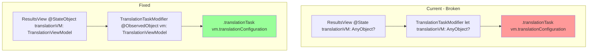
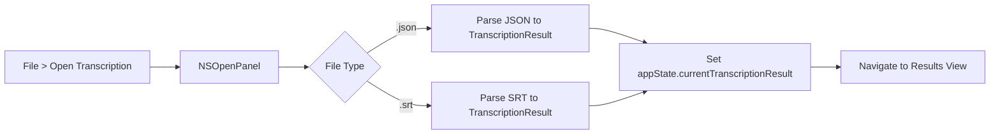
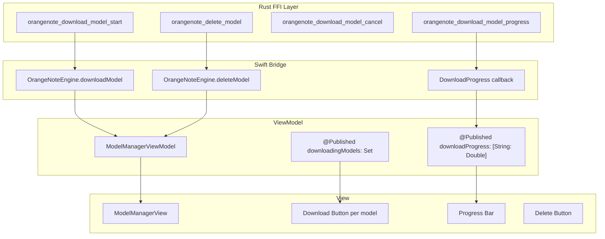

# OrangeNote v0.1.5 Architecture Plan

## Overview

This document outlines the architecture for all changes planned in v0.1.5, addressing bug fixes and new features.

---

## 1. Translation Fix — Diagnosis & Solution

### Current Problem
The translation feature shows a spinner but never completes. The user reports no output after waiting.

### Root Cause Analysis
After reviewing the code:

1. **`TranslationViewModel`** is stored as `@State private var translationVM: AnyObject?` in `ResultsView.swift:23`
2. The `.translationTask()` modifier in `TranslationTaskModifier` receives `translationVM` as `AnyObject?`
3. When `translationConfiguration` changes, `.translationTask()` should trigger, but the observation chain may be broken

**Key Issue:** The `TranslationTaskModifier` casts `AnyObject?` to `TranslationViewModel` and reads `vm.translationConfiguration`. However, since `translationVM` is `@State` (not `@StateObject`), and the modifier receives it as a plain parameter (not `@ObservedObject`), SwiftUI may not properly observe changes to `translationConfiguration`.

### Solution



**Changes Required:**

1. **`ResultsView.swift`** — Refactor to use `@StateObject` for `TranslationViewModel`
   - Since `@StateObject` cannot be conditionally initialized with `#available`, create a wrapper approach:
   ```swift
   // Option A: Use @StateObject with optional binding in body
   @StateObject private var translationVM = TranslationViewModelWrapper()
   
   // Option B: Create a separate TranslationEnabledResultsView for macOS 15+
   ```

2. **`TranslationTaskModifier`** — Change to use `@ObservedObject`:
   ```swift
   struct TranslationTaskModifier: ViewModifier {
       @ObservedObject var vm: TranslationViewModel  // Not AnyObject
   }
   ```

3. **Add Progress Tracking:**
   - Add `@Published var translationProgress: Double = 0` to `TranslationViewModel`
   - Update progress during batch translation loop
   - Display progress bar in `TranslationToolbarContent`

4. **Post-Translation Behavior:**
   - After translation completes, `showTranslation = true` already switches the view
   - Ensure the view properly re-renders by fixing the observation chain

---

## 2. Notification Fix

### Current Problem
Notifications are not received even though permission is granted in settings.

### Diagnosis Steps
1. Check if `NotificationService.requestPermission()` is called at app launch — ✅ Yes, in `OrangeNoteApp.init()`
2. Check if notifications are sent — ✅ Yes, `sendTranscriptionComplete` and `sendTranslationComplete` exist
3. **Possible Issue:** macOS notification center may require the app to be in background, or there's a permission issue

### Solution

1. **Add Test Notification Button in Menu:**
   ```swift
   // In OrangeNoteApp.swift, add to CommandGroup:
   Button("menu.testNotification") {
       NotificationService.sendTestNotification()
   }
   ```

2. **Add `sendTestNotification()` to `NotificationService`:**
   ```swift
   static func sendTestNotification() {
       let content = UNMutableNotificationContent()
       content.title = "OrangeNote"
       content.body = "Audio transcription app powered by Whisper. Version \(UpdateCheckerService.currentAppVersion)"
       content.sound = .default
       
       let request = UNNotificationRequest(
           identifier: "test-notification-\(UUID().uuidString)",
           content: content,
           trigger: nil
       )
       UNUserNotificationCenter.current().add(request)
   }
   ```

3. **Add Notification Delegate for Foreground Delivery:**
   ```swift
   // In OrangeNoteApp or AppDelegate:
   UNUserNotificationCenter.current().delegate = NotificationDelegate.shared
   
   class NotificationDelegate: NSObject, UNUserNotificationCenterDelegate {
       static let shared = NotificationDelegate()
       
       func userNotificationCenter(
           _ center: UNUserNotificationCenter,
           willPresent notification: UNNotification
       ) async -> UNNotificationPresentationOptions {
           return [.banner, .sound]  // Show even when app is in foreground
       }
   }
   ```

---

## 3. Export Menu Fix

### Current Problem
"File > Export Transcription" does nothing. User expects format selection dialog.

### Current Behavior
- `menu.export` sets `appState.triggerExport = true`
- `ContentView` responds by switching to `.results` tab
- No export dialog is shown

### Solution

**Option A: Show Export Sheet with Format Selection**

1. Add `@Published var showExportSheet: Bool = false` to `AppState`
2. When `triggerExport` is set, show a sheet with format picker and save button
3. Create `ExportSheet` view:
   ```swift
   struct ExportSheet: View {
       @ObservedObject var exportVM: ExportViewModel
       let result: TranscriptionResult
       @Binding var isPresented: Bool
       
       var body: some View {
           VStack {
               Picker("Format", selection: $exportVM.selectedFormat) { ... }
               Text(exportVM.exportedContent ?? "")  // Preview
               HStack {
                   Button("Cancel") { isPresented = false }
                   Button("Save") { exportVM.saveToFile(result: result); isPresented = false }
               }
           }
       }
   }
   ```

**Option B: Direct Save with Format in Save Panel**

1. Modify `ExportViewModel.saveToFile()` to show format picker in the save panel
2. Use `NSSavePanel.accessoryView` for format selection

**Recommended: Option A** — More user-friendly, shows preview before saving.

---

## 4. Import Transcriptions (JSON/SRT)

### Feature Description
Allow users to open previously saved transcription files (JSON or SRT) to view and translate them in the Results view.

### Architecture



### Implementation

1. **Add Menu Item:**
   ```swift
   // In OrangeNoteApp.swift
   CommandGroup(after: .newItem) {
       Button("menu.openTranscription") {
           appState.triggerOpenTranscription = true
       }
       .keyboardShortcut("o", modifiers: .command)
   }
   ```

2. **Add Import Service:**
   ```swift
   // TranscriptionImportService.swift
   enum TranscriptionImportService {
       static func importFromFile(url: URL) throws -> TranscriptionResult {
           let ext = url.pathExtension.lowercased()
           switch ext {
           case "json":
               return try importJSON(url: url)
           case "srt":
               return try importSRT(url: url)
           default:
               throw ImportError.unsupportedFormat
           }
       }
       
       private static func importJSON(url: URL) throws -> TranscriptionResult {
           let data = try Data(contentsOf: url)
           return try JSONDecoder().decode(TranscriptionResult.self, from: data)
       }
       
       private static func importSRT(url: URL) throws -> TranscriptionResult {
           let content = try String(contentsOf: url, encoding: .utf8)
           let segments = parseSRT(content)
           return TranscriptionResult(
               segments: segments,
               fullText: segments.map(\.text).joined(separator: " "),
               language: "unknown",
               duration: segments.last?.endTime ?? 0
           )
       }
   }
   ```

3. **Handle in ContentView:**
   ```swift
   .onChange(of: appState.triggerOpenTranscription) {
       guard appState.triggerOpenTranscription else { return }
       appState.triggerOpenTranscription = false
       openTranscriptionFile()
   }
   
   private func openTranscriptionFile() {
       let panel = NSOpenPanel()
       panel.allowedContentTypes = [.json, UTType(filenameExtension: "srt")!]
       if panel.runModal() == .OK, let url = panel.url {
           do {
               let result = try TranscriptionImportService.importFromFile(url: url)
               transcriptionVM.result = result  // or appState.currentTranscriptionResult
               selectedItem = .results
           } catch {
               // Show error
           }
       }
   }
   ```

---

## 5. Model Download & Delete in App

### Feature Description
Allow users to download and delete Whisper models directly from the Model Manager UI, without using CLI.

### Architecture



### Rust FFI Changes

The `download_model` function exists in `model_manager.rs` but is async and uses `indicatif` for CLI progress. We need to:

1. **Create a synchronous download with callback:**
   ```rust
   // In orangenote-ffi/src/lib.rs
   
   type ProgressCallback = extern "C" fn(downloaded: u64, total: u64, user_data: *mut c_void);
   
   #[no_mangle]
   pub extern "C" fn orangenote_download_model(
       model_name: *const c_char,
       progress_callback: Option<ProgressCallback>,
       user_data: *mut c_void,
       error_out: *mut *mut c_char,
   ) -> bool {
       // Use tokio runtime to run async download
       // Call progress_callback periodically
   }
   
   #[no_mangle]
   pub extern "C" fn orangenote_delete_model(
       model_name: *const c_char,
       error_out: *mut *mut c_char,
   ) -> bool {
       // Delete model file from cache
   }
   ```

2. **Add delete functionality to `WhisperModelManager`:**
   ```rust
   pub fn delete_model(&self, model: ModelSize) -> Result<()> {
       let path = self.get_model_path(model);
       if path.exists() {
           fs::remove_file(&path)?;
       }
       Ok(())
   }
   ```

### Swift Bridge Changes

```swift
// In OrangeNoteFFI.swift

typealias DownloadProgressCallback = @convention(c) (UInt64, UInt64, UnsafeMutableRawPointer?) -> Void

func downloadModel(
    name: String,
    progressHandler: @escaping (Double) -> Void,
    completion: @escaping (Result<Void, Error>) -> Void
) {
    // Run on background thread
    // Call FFI with callback wrapper
}

func deleteModel(name: String) throws {
    // Call orangenote_delete_model
}
```

### ViewModel Changes

```swift
// In ModelManagerViewModel.swift

@Published var downloadingModels: Set<String> = []
@Published var downloadProgress: [String: Double] = [:]

func downloadModel(_ model: WhisperModel) {
    downloadingModels.insert(model.name)
    downloadProgress[model.name] = 0
    
    engine.downloadModel(name: model.name) { [weak self] progress in
        DispatchQueue.main.async {
            self?.downloadProgress[model.name] = progress
        }
    } completion: { [weak self] result in
        DispatchQueue.main.async {
            self?.downloadingModels.remove(model.name)
            self?.downloadProgress.removeValue(forKey: model.name)
            self?.loadModels()  // Refresh list
        }
    }
}

func deleteModel(_ model: WhisperModel) {
    do {
        try engine.deleteModel(name: model.name)
        loadModels()  // Refresh list
    } catch {
        // Handle error
    }
}
```

### View Changes

```swift
// In ModelManagerView.swift

// For each model row:
if model.isCached {
    // Show "Show in Finder" and "Delete" buttons
    Button(role: .destructive) {
        viewModel.deleteModel(model)
    } label: {
        Image(systemName: "trash")
    }
} else {
    // Show "Download" button with progress
    if viewModel.downloadingModels.contains(model.name) {
        ProgressView(value: viewModel.downloadProgress[model.name] ?? 0)
    } else {
        Button {
            viewModel.downloadModel(model)
        } label: {
            Image(systemName: "arrow.down.circle")
        }
    }
}
```

---

## 6. Version Increment

Update version from 0.1.4 to 0.1.5 in:
- `project.yml`
- `OrangeNote/Info.plist`
- `CHANGELOG.md`

---

## Implementation Order

1. **Phase 1: Bug Fixes** (Priority: High)
   - [ ] Fix Translation observation chain
   - [ ] Fix Notifications (add delegate for foreground, add test button)
   - [ ] Fix Export menu (show format selection sheet)

2. **Phase 2: Import Feature** (Priority: Medium)
   - [ ] Add TranscriptionImportService
   - [ ] Add menu item and handler
   - [ ] Add SRT parser

3. **Phase 3: Model Download/Delete** (Priority: Medium-High, Complex)
   - [ ] Add Rust FFI functions (download with callback, delete)
   - [ ] Update Swift bridge
   - [ ] Update ViewModel and View
   - [ ] Test download progress and cancellation

4. **Phase 4: Finalization**
   - [ ] Increment version to 0.1.5
   - [ ] Update CHANGELOG.md
   - [ ] Update TODO.md
   - [ ] Final testing

---

## Localization Keys Required

```
// Menu
"menu.testNotification" = "Test Notification";
"menu.openTranscription" = "Open Transcription...";

// Notifications
"notification.test.title" = "OrangeNote";
"notification.test.body" = "Audio transcription app powered by Whisper. Version %@";

// Import
"import.error.unsupportedFormat" = "Unsupported file format";
"import.error.parseError" = "Failed to parse file: %@";

// Model Manager
"models.download" = "Download";
"models.delete" = "Delete";
"models.downloading" = "Downloading...";
"models.deleteConfirm.title" = "Delete Model?";
"models.deleteConfirm.message" = "This will remove the model file from your computer.";

// Export
"export.selectFormat" = "Select Export Format";
```

---

## Risk Assessment

| Feature | Risk | Mitigation |
|---------|------|------------|
| Translation Fix | Medium — SwiftUI observation is tricky | Test thoroughly on macOS 15 |
| Notifications | Low — Standard API | Add foreground delegate |
| Export Menu | Low — UI change only | Follow existing patterns |
| Import | Low — File parsing | Handle edge cases in SRT parser |
| Model Download | High — Async FFI with callbacks | Use tokio runtime, test cancellation |

---

## Files to Modify

### Swift Files
- `OrangeNote/OrangeNoteApp.swift` — Menu items, notification delegate
- `OrangeNote/Views/ResultsView.swift` — Translation fix
- `OrangeNote/ViewModels/TranslationViewModel.swift` — Progress tracking
- `OrangeNote/Views/ContentView.swift` — Import handler, export sheet
- `OrangeNote/Views/ModelManagerView.swift` — Download/delete UI
- `OrangeNote/ViewModels/ModelManagerViewModel.swift` — Download/delete logic
- `OrangeNote/Services/NotificationService.swift` — Test notification, delegate
- `OrangeNote/Bridge/OrangeNoteFFI.swift` — Download/delete FFI wrappers
- `OrangeNote/Models/AppState.swift` — New trigger flags
- NEW: `OrangeNote/Services/TranscriptionImportService.swift`
- NEW: `OrangeNote/Views/ExportSheet.swift`

### Rust Files
- `orangenote-ffi/src/lib.rs` — Download/delete FFI functions
- `orangenote-core/src/infrastructure/transcription/whisper/model_manager.rs` — Delete method

### Localization Files
- `OrangeNote/Resources/en.lproj/Localizable.strings`
- `OrangeNote/Resources/fr.lproj/Localizable.strings`
- `OrangeNote/Resources/ru.lproj/Localizable.strings`

### Config Files
- `project.yml` — Version
- `OrangeNote/Info.plist` — Version
- `CHANGELOG.md` — Release notes
- `TODO.md` — Update status
